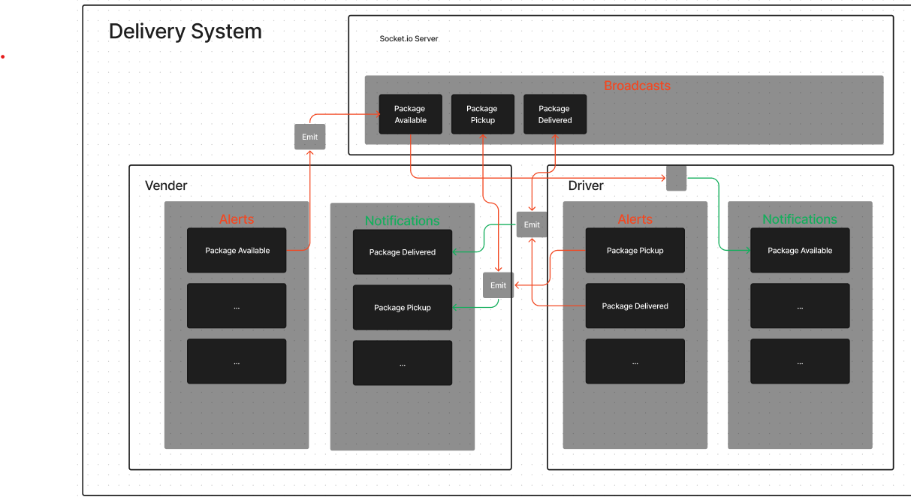

# CAPS

## The Code Academy Parcel Service Application uses Node Events to simulate businesses and their deliveries

## Phase 1 (LAB 11)

CAPS will simulate a delivery service where vendors (such a flower shops) will ship products using our delivery service and when our drivers deliver them, each vendor will be notified that their customers received what they purchased.

## Phase 2 (LAB 12)

Convert the event system to Socket IO Server, that handles the events between vendors and drivers. In real time.

### Resources

- 
- 
